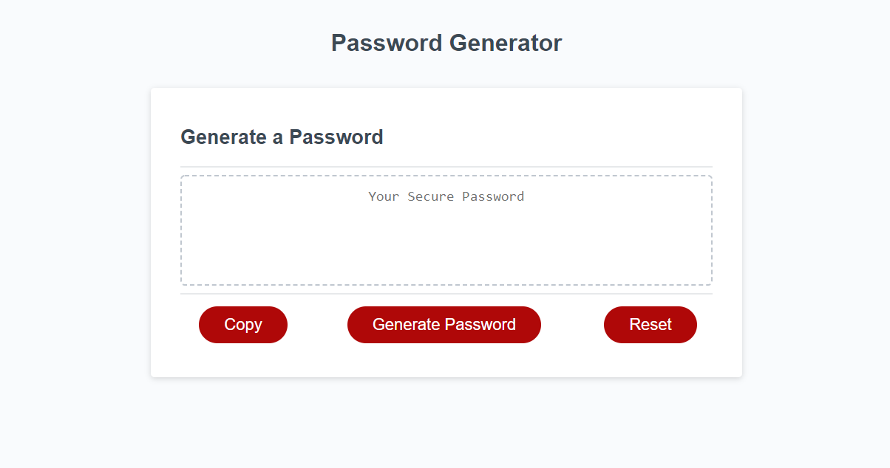

# Password Generator

## Purpose
Create a password generator program with JavaScript that randomly generates a password 8-128 characters in length with uppercase, lowercase, numeric and special characters based on the length and character type criteria selected.

## Built With
* HTML
* CSS
* JavaScript

## Website
https://joshsands.github.io/password-generator/

## GitHub Repository
https://github.com/Joshsands/password-generator

## Contribution
Made by Joshua Sands

## Screenshot

